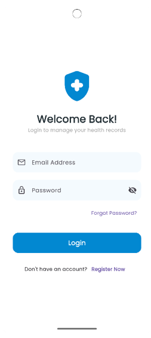
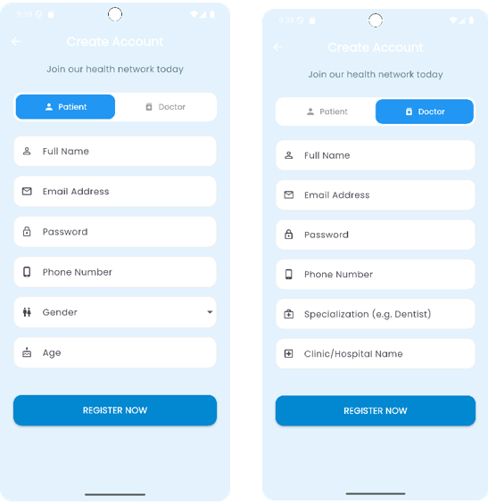
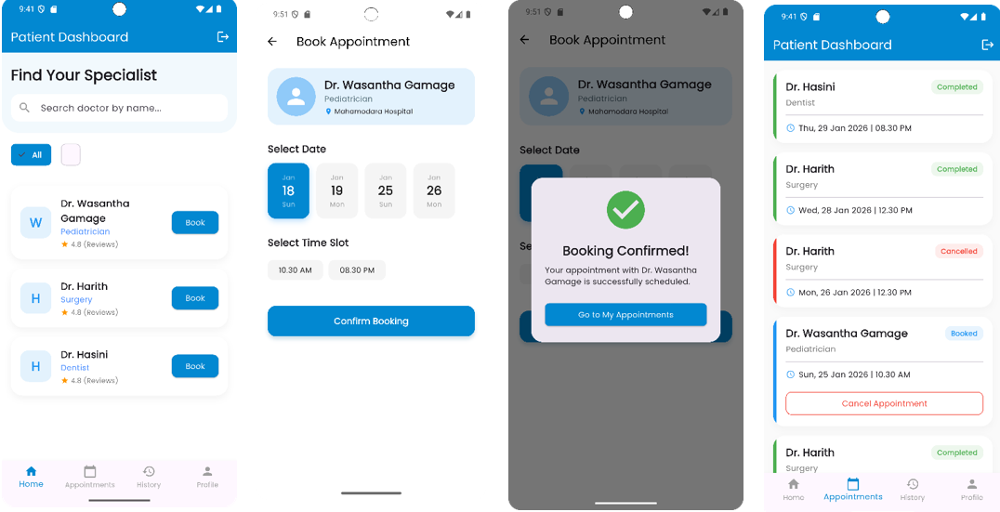
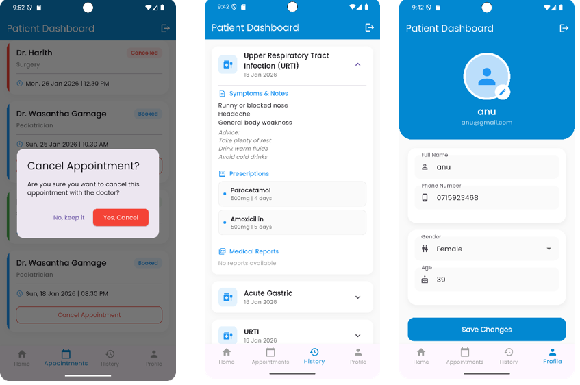
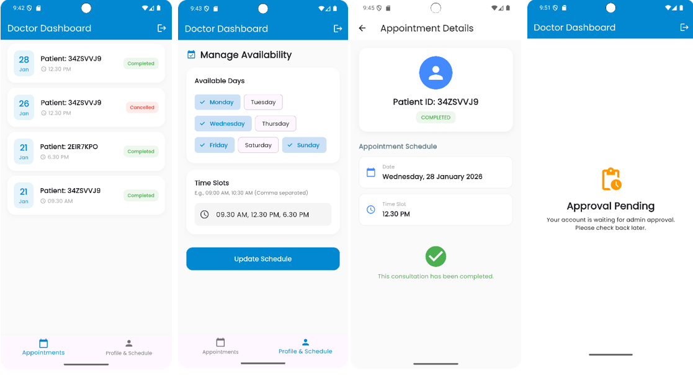
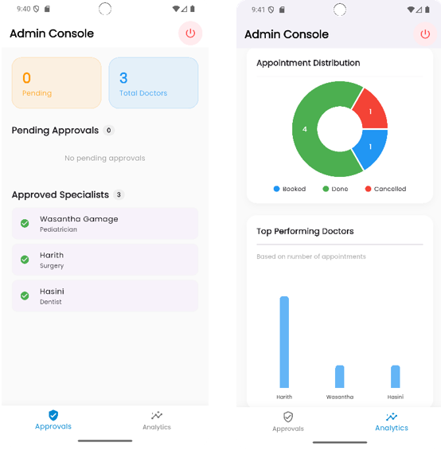

# Community Health & Appointment Management App

A comprehensive **digital healthcare platform** built with **Flutter and Firebase** to streamline medical appointments and health record management.

---

## 📌 Problem Statement

Traditional healthcare systems often rely on **manual, paper-based processes**, which often result in:

- Long patient waiting times  
- Misplaced or fragmented medical records  
- Poor coordination between patients and healthcare providers  

This application introduces a **centralized digital platform** designed to improve **accessibility, efficiency, and data security** within healthcare services.

---

## ✨ Features

### 👤 Patient Features

- **Secure Registration & Login**  
  Role-based authentication using Firebase Authentication.

- **Appointment Management**  
  Book and manage upcoming medical appointments.

- **Medical Dashboard**  
  View diagnoses, prescriptions, and complete medical history securely.

---

### 👨‍⚕️ Doctor Features

- **Patient Management**  
  Access assigned patient profiles and medical records.

- **Digital Prescriptions**  
  Add diagnoses and prescriptions directly through the application.

- **Schedule Management**  
  Manage availability days and appointment time slots.

---

### 🔑 Admin Features

- **Doctor Verification**  
  Approve and manage doctor accounts before granting system access.

- **Real-Time Analytics Dashboard**  
  Monitor appointment distribution and view top-performing specialists using data visualization.

---

## 🛠 Technical Specifications

| Component | Technology |
|-----------|------------|
| **Framework** | Flutter (Dart) |
| **Backend** | Firebase |
| **Authentication** | Firebase Authentication |
| **Database** | Cloud Firestore |
| **Storage** | Firebase Storage |
| **Platform** | Android |
| **Architecture** | Role-Based Access Control (RBAC) |

---

## 📸 UI Preview

The application features a **clean, professional blue-and-white interface** designed for usability across all user roles.

Key interfaces include:

### Login/Register Screen



### Patient Dashboard



### Doctor Dashboard


### Admin Dashboard



---

## 🚀 Getting Started

### Prerequisites

- Flutter SDK installed
- Android Studio or VS Code
- Firebase Project Setup
- Android Emulator or Physical Device

### Installation

```bash
git clone https://github.com/sandu20021111/community-health-app.git
cd community-health-app
flutter pub get
flutter run
